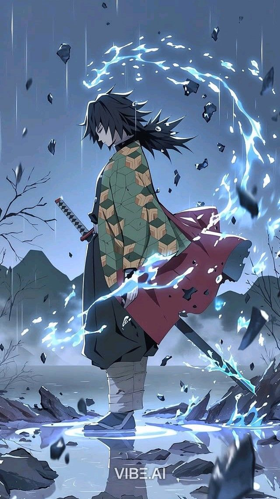

  

Electronics and Computing enthusiast focused on VLSI, Embedded Systems, and Hardware Security.   Working on SRAM startup entropy, analog noise analysis, and TRNG design, with a strong interest in combining semiconductor-level behavior with AI to build secure and intelligent hardware systems.

## 🌐 Socials:
   

# 💻 Tech Stack:
              

<!-- ================= STATS CONTAINER ================= -->

<h2>📊 GitHub Stats</h2>

  

<!-- ================= EXTRA ANALYTICS ================= -->

<h2>⚡ Development Metrics</h2>

<table align="center">
<tr>
<td>

</td>
<td>

</td>
</tr>
</table>

<!-- ================= CONTRIBUTION GRAPH ================= -->

<h2>📈 Contribution Activity</h2>

  

<!-- ================= PROJECT + IMAGE SECTION ================= -->

<table width="100%">
<tr>

<!-- LEFT COLUMN (PROJECTS) -->
<td width="60%" valign="top">

## 🚀 Projects

### 🔹 SRAM Startup-Based TRNG
- Extracted entropy from SRAM startup states  
- Applied XOR folding & Von Neumann correction  
- Evaluated randomness using Shannon entropy  

---

### 🔹 Analog Noise Entropy Analysis
- Studied electrical noise behavior  
- Bias & spatial correlation analysis  
- Improved randomness for cryptographic use  

---

### 🔹 Smart Irrigation System
- Arduino-based automation  
- Soil moisture sensing  
- Automatic pump control  

</td>

<!-- RIGHT COLUMN (IMAGE) -->
<td width="40%" align="center">

</td>

</tr>
</table>

### ✍️ Random Dev Quote

---

<!-- Proudly created with GPRM ( https://gprm.itsvg.in ) -->
